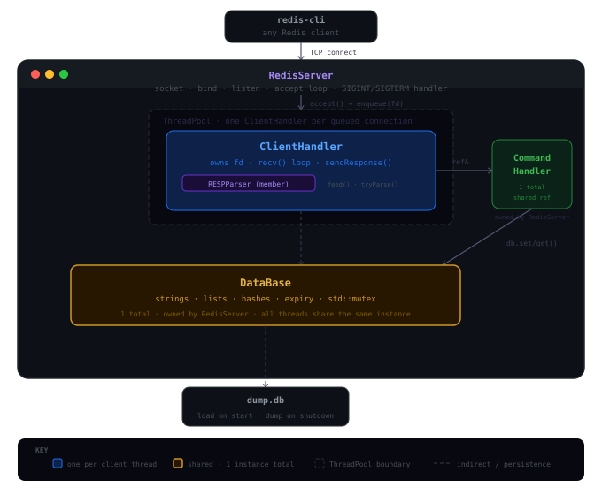
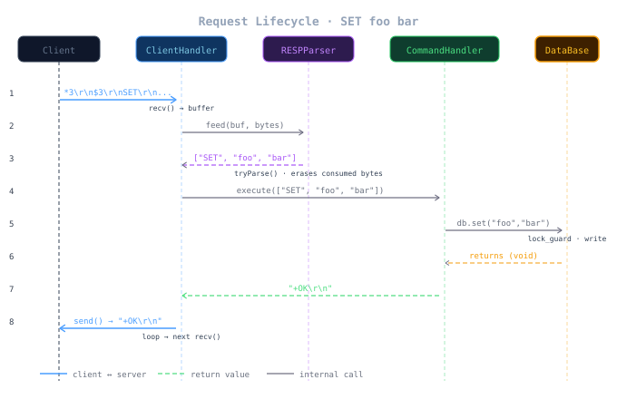

# redis-server

A Redis-compatible in-memory key-value database server built from scratch in C++17. Implements the RESP (Redis Serialization Protocol), a thread pool for concurrent client handling, lazy key expiration, and simple text-based persistence.

```
redis-cli -p 6666
127.0.0.1:6666> SET name "Adnan"
OK
127.0.0.1:6666> GET name
"Adnan"
127.0.0.1:6666> EXPIRE name 10
(integer) 1
```

---

## Architecture



## Request Lifecycle



Every client command follows this path — raw TCP bytes in, RESP-encoded response out. The parser accumulates bytes across `recv()` calls to handle partial reads and pipelined commands correctly.

### Class responsibilities

| Class | Owns | Does NOT know about |
|---|---|---|
| `RedisServer` | socket, accept loop, thread pool | RESP, commands, data |
| `ClientHandler` | client fd, read/write loop | what commands mean |
| `RESPParser` | internal byte buffer | sockets, commands |
| `CommandHandler` | command dispatch | sockets, protocol |
| `DataBase` | all data + mutex | sockets, RESP, clients |

---

## Features

- **RESP protocol** — full Redis Serialization Protocol parsing with stream buffering (handles TCP partial reads and pipelining)
- **Thread pool** — fixed pool of `N` worker threads (`N` = CPU core count), no unbounded thread spawning
- **Three data types** — strings, lists (deque-backed), hashes
- **Key expiration** — `EXPIRE` with lazy eviction on read
- **Persistence** — text-based dump/load (`dump.db`) on shutdown and startup
- **Clean shutdown** — `SIGINT`/`SIGTERM` handled, database dumped before exit
- **Standard Redis client compatible** — works with `redis-cli` out of the box

---

## Supported Commands

### General
| Command | Description |
|---|---|
| `PING [message]` | Returns PONG or echoes message |
| `ECHO message` | Returns message |
| `FLUSHALL` | Deletes all keys |

### Strings
| Command | Description |
|---|---|
| `SET key value` | Store a string value |
| `GET key` | Retrieve a value |
| `DEL key` / `UNLINK key` | Delete a key |
| `EXISTS key` | Check if key exists |
| `TYPE key` | Return type of key |
| `KEYS *` | Return all keys |
| `EXPIRE key seconds` | Set TTL in seconds |
| `RENAME oldkey newkey` | Rename a key |

### Lists
| Command | Description |
|---|---|
| `LPUSH key value [value ...]` | Prepend values |
| `RPUSH key value [value ...]` | Append values |
| `LPOP key` | Remove and return first element |
| `RPOP key` | Remove and return last element |
| `LLEN key` | Return list length |
| `LINDEX key index` | Get element by index (negative supported) |
| `LSET key index value` | Set element at index |
| `LREM key count value` | Remove occurrences of value |
| `LGET key` | Return all elements |

### Hashes
| Command | Description |
|---|---|
| `HSET key field value` | Set a field |
| `HGET key field` | Get a field |
| `HEXISTS key field` | Check if field exists |
| `HDEL key field` | Delete a field |
| `HLEN key` | Number of fields |
| `HKEYS key` | All field names |
| `HVALS key` | All values |
| `HGETALL key` | All field-value pairs |
| `HMSET key field value [field value ...]` | Set multiple fields |

---

## Project Structure

```
redis-server/
├── include/
│   ├── ClientHandler.hpp   — per-connection handler
│   ├── CommandHandler.hpp  — command dispatch
│   ├── DataBase.hpp        — data store interface
│   ├── RESPParser.hpp      — RESP stream parser
│   ├── RedisServer.hpp     — TCP server + thread pool wiring
│   └── ThreadPool.hpp      — fixed worker thread pool
├── src/
│   ├── ClientHandler.cpp
│   ├── CommandHandler.cpp
│   ├── DataBase.cpp
│   ├── RESPParser.cpp
│   ├── RedisServer.cpp
│   ├── ThreadPool.cpp
│   └── main.cpp
├── test.sh                 — full test suite (87 tests)
└── Makefile
```

---

## Build & Run

**Requirements:** `g++` with C++17, `make`

```bash
# build
make

# run on default port 6666
./bin/redis-server

# run on custom port
./bin/redis-server 6379

# clean build
make clean && make
```

Connect with any Redis client:

```bash
redis-cli -p 6666
```

---

## Testing

```bash
chmod +x test.sh

# run against default port 6666
./test.sh

# run against custom port
./test.sh 6379
```

The test suite covers all 87 cases across every command group including edge cases, negative indices, pipelining, and TTL expiry.

```
━━━ PING / ECHO ━━━          PASS (4/4)
━━━ SET / GET ━━━             PASS (9/9)
━━━ DEL / EXISTS ━━━          PASS (7/7)
━━━ KEYS / TYPE ━━━           PASS (3/3)
━━━ EXPIRE / TTL ━━━          PASS (5/5)
━━━ RENAME ━━━                PASS (3/3)
━━━ FLUSHALL ━━━              PASS (3/3)
━━━ LIST — LPUSH/RPUSH ━━━    PASS (6/6)
━━━ LIST — LPOP/RPOP ━━━      PASS (5/5)
━━━ LIST — LINDEX/LSET ━━━    PASS (8/8)
━━━ LIST — LREM ━━━           PASS (6/6)
━━━ HASH — HSET/HGET ━━━      PASS (10/10)
━━━ HASH — HLEN/HKEYS ━━━     PASS (5/5)
━━━ HASH — HMSET ━━━          PASS (3/3)
━━━ EDGE CASES ━━━            PASS (7/7)
━━━ PIPELINING ━━━            PASS (3/3)
────────────────────────────────────────
Results: 87 passed, 0 failed
```

---

## Design Decisions

**Thread pool over thread-per-client** — spawning one thread per connection is simple but doesn't scale. A fixed pool of N workers (where N = CPU cores) bounds memory usage and avoids context switching storms under high connection counts.

**`deque` for lists** — `std::deque` gives O(1) `push_front` and `push_back`, making `LPUSH`/`RPUSH`/`LPOP`/`RPOP` all constant time. A `vector` would make `LPUSH` O(n).

**Lazy expiration** — expired keys are evicted on read rather than by a background timer. Simple to implement, correct, and avoids an extra thread. The tradeoff is that expired keys consume memory until accessed.

**Dependency injection over singleton** — `DataBase` is owned by `RedisServer` and passed by reference to `CommandHandler`. No global state, no `getInstance()`. Every dependency is explicit and testable.

**`RESPParser` as a stateful class** — the parser holds an internal byte buffer because TCP is a stream. A single `recv()` may return a partial message or multiple messages. The buffer accumulates bytes across calls and `tryParse()` extracts complete messages when available.

---

## Persistence Format

The database is saved to `dumped.db` on shutdown and loaded on startup. Simple text format, one record per line:

```
S key value
L listkey item
H hashkey field value
```
